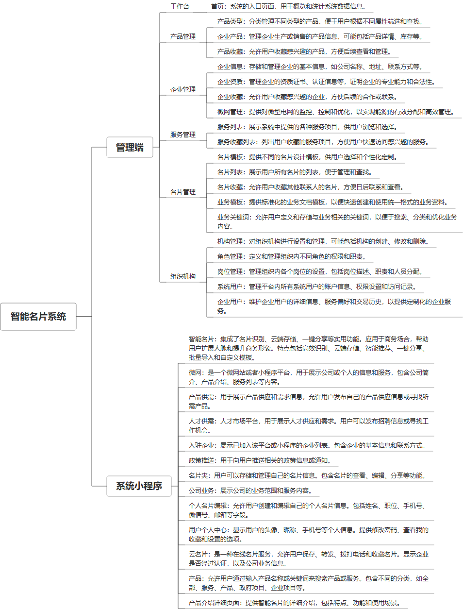

 

    
 

公司拥有上百套具有自主知识产权的软件系统，详情请查看码云首页或公司官网

 
<h1>企业名片系统</h1>

<a href="https://www.haishi.net.cn/">公司官网</a> ｜ <a href="https://www.haishi.net.cn/">在线体验</a>

 

## 系统介绍

企业智能名片系统，标记浏览者信息。
---
本项目名称为品讯企业名片管理系统，是一款面向企业用户的数字化名片管理系统。该系统旨在帮助企业更好地管理企业信息、产品信息以及员工名片，提升企业形象和市场竞争力。
本项目包含管理端和用户端：
- 管理端：企业内部管理员使用，可以进行企业信息管理、产品管理、名片管理、组织机构管理、服务管理、系统监控等操作。
- 用户端：企业员工使用，可以创建和管理个人电子名片，并通过多种方式分享名片信息。
---
                

## 系统功能介绍

### 系统包含终端说明

管理端（WEB）、用户端（微信小程序）

| 序号 | 模块                 | 模块说明 |
| ---- | -------------------- | -------- |
| 1    | QHY-ZNMP-QYBJ-MANAGE | 管理端   |
| 2    | QHY-ZNMP-QYBJ-MP     | 小程序   |
| 3    | QHY-ZNMP-QYBJ-SERVER | 服务端   |

### 系统功能结构

### 系统功能说明

- 企业信息管理：企业可以创建和维护企业信息，包括企业简介、资质证书、联系方式等，方便客户了解企业。
- 产品管理：企业可以创建和管理产品信息，包括产品图片、参数、介绍等，方便客户了解产品。
- 名片管理：企业可以创建和管理员工名片，包括姓名、职位、联系方式、社交账号等，方便员工与客户建立联系。
- 组织机构管理：企业可以创建和管理组织机构，方便企业内部管理和沟通。
- 服务管理：企业可以发布和管理服务项目，方便客户了解企业提供的服务。

## 系统主要界面

## 系统技术说明

### 代码模块说明

| 序号 | 目录                                  | 目录说明 |
| ---- | ------------------------------------- | -------- |
| 1    | QHY-ZNMP-QYBJ-SERVER/jeeplus-module   | --       |
| 2    | QHY-ZNMP-QYBJ-SERVER/jeeplus-web      | --       |
| 3    | QHY-ZNMP-QYBJ-SERVER/jeeplus-platform | --       |
| 4    | QHY-ZNMP-QYBJ-SERVER/jeeplus-plugins  | --       |
| 5    | QHY-ZNMP-QYBJ-SERVER/.idea            | --       |

### 系统技术选型

#### 开发语言/框架

JAVA（JDK1.8）
前端框架：VUE2
前端框架：uni-app
脚手架：JEEPLUS
框架：SpringBoot2.x
系统结构：单体应用

#### 服务中间件

Nginx
Tomcat

#### 数据库

MySQL（5.7+）

#### 其他说明

无

## 系统演示/商用

请扫码添加客服微信获取演示地址和系统详细资料。

如果您想基于企业名片系统进行商业化交付或定制开发服务，我们提供有偿的技术服务支持，合作模式不限，欢迎沟通！

公司官网地址： <a href="https://www.haishi.net.cn/">https://www.haishi.net.cn</a>

联系客服获取专业回答。

## 使用须知

1、 本项目商用必须获得版权所有者的授权。

2、 未经允许本项目代码不允许二次出售。

